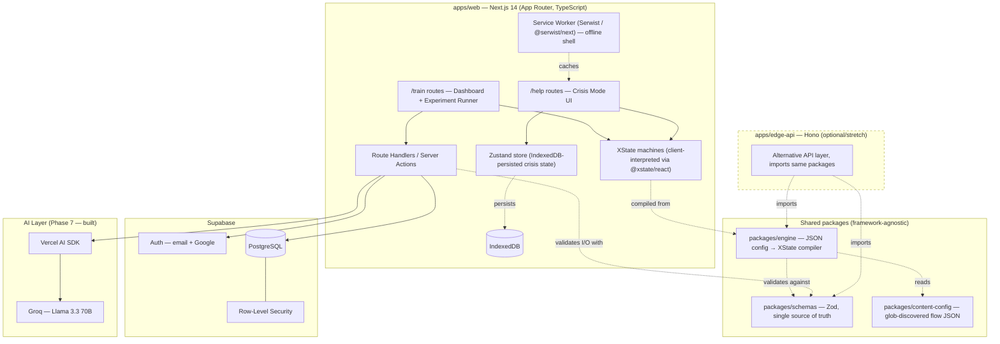
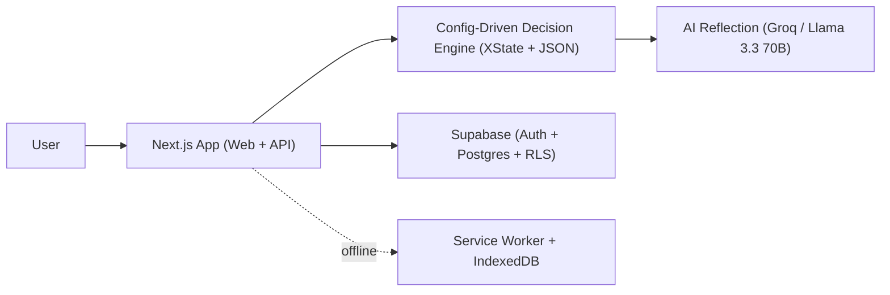

# IsItFR? — System Reference (v1.0)

## 1. Vision
IsItFR? teaches media & information literacy by putting people inside manipulation
instead of testing whether they can define it, AND gives them a real, working tool
for the moment a deepfake actually targets someone they know. Two experiences,
one shared engine.

## 2. User Journeys (kept deliberately separate — never merged in UI)

**Training path** (`/train`, requires account): sign in → dashboard of experiments →
pick one → go through an interactive scenario without knowing what's being measured →
get an AI-generated reflection report → profile builds over time. Results
(`flow_sessions`, `flow_interactions`, `flow_scores`, and the profile rollup)
are saved automatically once you're signed in. There is no local-only training
run and no separate "save my results" step.

**Crisis path** (`/help`, no account, ever): one tap → five fixed steps (stop,
preserve evidence, choose who to tell, send a template message, get resources) →
leave. No score. No login. Completing Crisis Mode never writes a Supabase row.

The canned template and resources are always available offline after first
load. Completing the five steps never requires a network call.

**Optional template rewording (the only Crisis network exception):** after the
static template is on screen, an explicit tap ("Make this sound more like me")
may `POST /api/crisis/personalize-template` with the **template key only**. The
server sends the already-fixed canned body to the model, with name slots
replaced by a `{{name}}` token — never the user-typed name (that substitution
stays on-device). The model may only reword that copy; it does not invent
steps, advice, or resources. If the user is offline, the request fails, or the
model is unavailable, the UI keeps the canned template. The route is
rate-limited. This path is never required to finish Crisis Mode.

## 3. Current scope
Phases 1–8 are in this tree: shared engine, Crisis Mode (standalone, offline
after first load), four scored experiments, analytics, AI reflection /
optional template rewording, Playwright journeys, a11y, and Vercel deploy of
`apps/web` only. Flow configs remain static JSON under
`packages/content-config` (not CMS tables). `apps/edge-api` stays parked.

**Memory experiment clip (locked for this MVP):** `memory-recall` plays the
MDN interactive-examples **CC0 flower** clip, not original or news-style
footage. The BRANCH options are written against that file (petal color;
close-up bloom vs a bee/garden confabulation), so the MEASURE diamond still
scores accurate vs misleading recall. That is enough for demo and submission.
It is **not** a topical misinformation clip. Replace with a short,
clearly-licensed mock news-style video (original or equivalently licensed)
before a wider public release — do not swap in an unvetted hotlink just to
look like news.

## 4. Shared Step Schema — the core contract
This is the single most important design decision in the system. Every flow —
Crisis Mode or any future experiment — is data, validated against this schema,
never hardcoded into a component.

```typescript
// packages/schemas/src/flow.ts
import { z } from "zod";

export const StepTypeEnum = z.enum([
  "STOP", "PRESERVE", "BRANCH", "TEMPLATE", "RESOURCES", "MEASURE",
]);

export const StepOptionSchema = z.object({
  label: z.string(),
  value: z.string(),
  next: z.string(), // target step key
});

export const StepSchema = z.object({
  type: StepTypeEnum,
  prompt: z.string(),
  why: z.string().optional(),
  templateKey: z.string().optional(),   // TEMPLATE steps
  resourceSet: z.string().optional(),   // RESOURCES steps
  metric: z.string().optional(),        // MEASURE steps
  weight: z.number().optional(),        // MEASURE steps
  options: z.array(StepOptionSchema).optional(), // BRANCH steps
  next: z.string().optional(),          // linear steps
  payload: z.record(z.string(), z.unknown()).optional(),
});

export const FlowConfigSchema = z.object({
  flowId: z.string(),
  version: z.number().int().positive(),
  type: z.enum(["crisis", "experiment"]),
  title: z.string(),              // /train display title — not the construct
  track: z.string().optional(),   // required when type is experiment; internal (profile/radar), never listed on /train
  teaser: z.string().optional(),  // required when type is experiment
  skin: z.enum(["chat-bubble"]).optional(), // presentation only; engine ignores
  initial: z.string(),
  steps: z.record(z.string(), StepSchema), // keyed dynamically — no hardcoded step list anywhere
});

export type FlowConfig = z.infer<typeof FlowConfigSchema>;
export type Step = z.infer<typeof StepSchema>;
```

**Adding a flow (glob discovery — no code changes):** Drop a valid
`{flowId}.v{version}.json` file into `packages/content-config/src/flows/`.
At module init, `@isitfr/content-config` enumerates every `*.v*.json` file in
that directory via build-time glob discovery (`import.meta.glob` under
Vite/Vitest; webpack `require.context` under Next.js; Node `fs` at module init
when no bundler glob is available), validates each with
`validateFlowConfig`, and builds an in-memory map keyed by `flowId`.
`getFlow(flowId)` and `listExperiments()` read that map — never a manual
per-flow import or registry entry in `packages/content-config` or `apps/web`.
An invalid file in that directory throws at load (build/test failure), it
does not silently disappear from the list.

**Step chrome (per-step-type defaults, not per-flow):** Eyebrow/title labels,
action buttons, and empty-state copy for STOP / PRESERVE / BRANCH / TEMPLATE /
RESOURCES / MEASURE live in
`packages/content-config/src/chrome/stepChrome.en.json`, loaded via
`getStepChrome()`. They are shared UI chrome for every flow. MEASURE chrome is
an in-scene label, never the word "Measure". Scenario copy
(`prompt`, `why`, option labels, templates, resources, `payload`) stays on
the flow JSON. Do not hardcode chrome strings in
`apps/web/src/components/flow-steps`.

**Step payload (generic, per-experiment):** `payload` is optional stimulus
the engine does not understand — article variants, clips, and other
experiment-specific content. The core schema only types it as
`Record<string, unknown>`. Stricter shapes (for example
`payload.kind === "article-compare"`) are validated at the component that
renders that kind, not in `StepSchema`. Do not add per-experiment fields to
the shared step contract.

**Flow skin (presentation only):** optional `skin: "chat-bubble"` restyles
`StepRenderer` output. The engine and `compileFlowToMachine` ignore it. It
is not a step type. On that skin, a MEASURE whose prompt is only the shared
Continue chrome auto-advances (no card); recording is the same `NEXT` as a
tap.

### BRANCH choices and scoring (locked decision)

**Decision: (a) — encode the choice in the flow graph.** Each BRANCH option
that should affect a score routes to its own downstream MEASURE step with a
fixed `metric` and `step.weight`. The path taken *is* the score.

**Phase 6 data path (locked):** the live XState machine still records
`{ metric, value }` on `context.measurements` during the run. Durable scoring
does **not** read that in-memory context. The client persists MEASURE rows to
`flow_interactions` (`step_id`, `choice_value`). `POST /api/sessions/[id]/score`
loads those rows and remaps them through the compiled flow JSON: a MEASURE
step's `metric` plus a numeric `choice_value` that must already be a legitimate
weight (or range) declared for that step. BRANCH rows are ignored. Values
outside the declared set are dropped, not written to `flow_scores`.

**Not (b).** The engine does **not** write BRANCH option values into
`context.answers`. That field stays empty for scoring. Crisis Mode still
persists the picked option in Zustand for IndexedDB resume — resume is not
the scoring channel, and experiments must not copy that pattern.

When a MEASURE step receives `NEXT` without a numeric `value`, the engine
records `{ metric, value: step.weight ?? 0 }`. An explicit numeric `value`
on the event still wins (slider / rated MEASURE).

Phase 5 Framing should copy this diamond, not invent answer-lookups:

`packages/content-config/src/flows/experiment-framing-pattern.v1.json`
(BRANCH `headline` → `measure_amplify` weight `1` / `measure_verify` weight
`0` → shared `done`).

## 5. Data Model (ER Diagram)

```mermaid
erDiagram
    USERS ||--o| PROFILES : has
    USERS ||--o{ FLOW_SESSIONS : starts
    FLOWS ||--o{ FLOW_VERSIONS : "versioned by"
    FLOWS ||--o{ FLOW_SESSIONS : "instance of"
    FLOWS ||--o{ MESSAGE_TEMPLATES : "may reference"
    FLOWS ||--o{ RESOURCES : "may reference"
    FLOW_VERSIONS ||--o{ FLOW_SESSIONS : "run against"
    FLOW_SESSIONS ||--o{ FLOW_INTERACTIONS : logs
    FLOW_SESSIONS ||--o{ FLOW_SCORES : produces
    FLOW_SESSIONS ||--o| REPORTS : generates
    FLOW_SCORES }o--|| PROFILES : "aggregates into"

    USERS { uuid id PK "references auth.users" string email timestamp created_at }
    PROFILES { uuid user_id PK_FK jsonb aggregated_scores timestamp updated_at }
    FLOWS { uuid id PK string key UK string type "crisis|experiment" string title string track string status timestamp created_at }
    FLOW_VERSIONS { uuid id PK uuid flow_id FK int version_number jsonb config boolean is_active timestamp created_at }
    FLOW_SESSIONS { uuid id PK uuid flow_id FK uuid flow_version_id FK uuid user_id FK "nullable" boolean is_anonymous string status timestamp started_at timestamp completed_at }
    FLOW_INTERACTIONS { uuid id PK uuid session_id FK string step_id string choice_value int reaction_time_ms int confidence timestamp created_at }
    FLOW_SCORES { uuid id PK uuid session_id FK string metric_name float metric_value }
    REPORTS { uuid id PK uuid session_id FK uuid user_id FK text content string model_used timestamp generated_at }
    MESSAGE_TEMPLATES { uuid id PK uuid flow_id FK string key string locale text body }
    RESOURCES { uuid id PK uuid flow_id FK string region string category string title string url }
```

**Important scope note:** `FLOWS`/`FLOW_VERSIONS` model the *full future* system
(a CMS-editable flow store). In Phases 1–4, flow configs are static, versioned
JSON files under `packages/content-config/src/flows/`, glob-discovered at
module init — NOT read from these Supabase tables — because Crisis Mode must
work fully offline with zero network dependency. Do not wire DB-backed flow
loading until told to in a later phase.

## 6. System Architecture (development view)



**AI layer:** training reflection (`POST /api/sessions/[id]/reflect`) and optional Crisis template rewording (`POST /api/crisis/personalize-template`) call Groq `llama-3.3-70b-versatile` through the Vercel AI SDK (`GROQ_API_KEY`, never a public prefix). Groq is used because it is free, requires no billing, and serves open-source models only.

## 7. High-Level Architecture (pitch view)



## 8. Non-negotiable Engineering Principles
1. No hardcoded step sequences, scenario copy, resource lists, or step chrome in components — always from `packages/content-config` via a typed loader. **Extensibility is glob discovery, not a manual registry:** add a flow by dropping a valid `{flowId}.v{version}.json` into `src/flows/`; `@isitfr/content-config` enumerates `*.v*.json` at module init (`import.meta.glob` / webpack `require.context` / Node `fs`) and `getFlow` / `listExperiments` read that map. Do not add a per-flow import or registry entry. Step chrome is per-step-type defaults in `src/chrome/stepChrome.en.json` (see §4).
2. Exactly one schema definition (`packages/schemas`) — never redefine flow/step shapes locally.
3. `packages/engine` is framework-agnostic — no React, no Supabase, importable by `apps/web` and the parked `apps/edge-api`.
4. Crisis Mode (`/help`) must work with zero auth, forever, and with zero
   network calls after first load **except** the optional personalize tap in
   §2. Completing Crisis Mode must never depend on that request. Training is
   the opposite contract: `/train` requires an account, and signed-in runs
   persist to Supabase as you go (not opt-in, not on-device-only).
5. Deterministic scoring stays separate from the LLM — the model never
   generates the sequence of safety steps, only rewords already-fixed content
   (Crisis template personalize) or describes already-computed scores
   (training reflection).
6. RLS is default-deny; permissive policies are added explicitly, one at a time, as auth is wired.
7. Strict TypeScript, no `any`.

## 9. Full Phase Map (Phases 1–8 are built)
1. Foundation & Shared Contracts
2. Core Decision-Tree Engine
3. Crisis Mode (Complete, Standalone)
4. Simulation Engine & Experiment Framework
5. Build the Four Experiments
6. Analytics Engine
7. AI Reflection Layer
8. Integration, Polish, and Submission

## 10. Scoring rules are data

How a run's MEASURE observations become a score is JSON, not code. Drop
`{flowId}.v{version}.json` into `packages/content-config/src/scoring-rules/`.
Each file is an array of `ScoringRule` objects (`packages/schemas` —
`ScoringRuleSchema`): `metric`, `aggregation` (`sum` | `average` | `last`),
`normalizeToRange` `[low, high]`, `description`.

A rule only says how to **combine** observations already recorded on that
flow. `metric` **must already exist** on a MEASURE step in the matching flow
JSON — scoring-rules cannot invent measurements, weights, or step sequences.
A rule that names a metric the flow never emits is invalid (caught at load /
test), not a silent extra score. Phase 6 applies these rules to MEASURE
`flow_interactions` remapped through that flow JSON (§4); it does not look up
BRANCH answers.

After a session's `flow_scores` are written, `aggregateProfile(userId)`
recomputes `profiles.aggregated_scores` from **all** of that user's completed
sessions. Default rollup per dimension is average across sessions; a rule
may set `acrossSessions` (`sum` | `average` | `last`) to override. This runs
**synchronously** on `POST /api/sessions/[id]/score` after the score upsert
(not fire-and-forget): the completion response means scores and profile are
both durable, and a missed background job would leave the profile stale with
no retry. Writes use the service role; Phase 4 RLS
(`profiles_select_own` / `profiles_update_own`, `auth.uid() = user_id`) still
blocks any other authenticated user from reading the row.